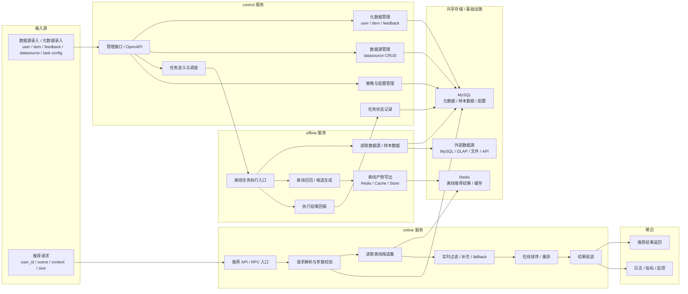

# Nexus 架构说明

## 1. 架构目标

`Nexus` 当前拆分为三个核心服务：

- `control`：控制面，负责管理系统配置、资源和任务
- `offline`：离线执行层，负责批量生成推荐产物
- `online`：在线服务层，负责接收推荐请求并返回最终结果

可以把它们简单理解为：

- `control` 决定系统怎么运行
- `offline` 提前算好可用的候选结果
- `online` 在请求到来时决定最终返回什么

## 2. 总体流程图



## 3. 服务职责

### 3.1 `control`

`control` 是系统的控制面。

它不负责真正执行离线推荐，也不直接承担最终推荐结果计算；它主要负责“管理”和“调度”。

负责的事情：

- 管理 `user / item / feedback`
- 管理 `datasource`
- 管理推荐相关配置和策略
- 定义离线任务
- 调度并下发离线任务
- 记录任务状态、执行结果和系统元数据

`control` 负责定义系统资源，并驱动整个推荐系统运行。

### 3.2 `offline`

`offline` 是离线执行层，本质上更接近一个 `worker`。

它负责接收 `control` 下发的任务，并执行离线推荐相关计算。

负责的事情：

- 接收离线任务请求
- 读取业务数据、样本数据和外部数据源
- 执行离线召回或候选集生成
- 计算离线推荐结果
- 将产物写入 `Redis` 或其他存储
- 回报任务执行结果给 `control`

### 3.3 `online`

`online` 是在线推荐服务。

它负责在请求到来时读取离线结果，并结合实时上下文生成最终返回结果。

负责的事情：

- 接收推荐请求
- 解析请求参数和场景信息
- 读取离线候选集
- 做实时过滤、补充和 `fallback`
- 做在线排序或重排
- 组装并返回最终推荐结果

## 4. 两条主链路

### 4.1 控制面链路

```text
数据源录入 / 元数据录入
    -> control
    -> 定义任务与策略
    -> 调度 offline
    -> offline 产出离线结果
    -> control 记录状态
```

这条链路解决的是：

- 系统里有什么资源
- 这些资源如何被使用
- 离线任务如何被触发和管理

### 4.2 推荐链路

```text
推荐请求
    -> online
    -> 读取离线候选
    -> 实时过滤 / 补充 / 排序
    -> 推荐结果返回
```

这条链路解决的是：

- 用户请求来了之后该返回什么
- 如何把离线结果和实时上下文拼起来

## 5. 输入与输出

### `control`

输入：

- 管理请求
- 配置变更
- 数据源定义
- 任务定义

输出：

- 系统配置
- 任务调度请求
- 任务状态记录

### `offline`

输入：

- 任务请求
- 样本数据
- 数据源数据
- 策略配置

输出：

- 离线候选集
- 推荐缓存
- 执行状态

### `online`

输入：

- 推荐请求
- 离线推荐结果
- 实时上下文

输出：

- 最终推荐列表

## 6. 当前阶段建议

当前阶段建议优先打通的最小闭环是：

1. 在 `control` 中录入 `user / item / feedback / datasource`
2. 在 `control` 中定义一个离线任务
3. `control` 调度 `offline`
4. `offline` 生成推荐结果并写入 `Redis`
5. `online` 读取离线结果并返回推荐结果

## 7. 一句话总结

- `control`：负责管理和调度
- `offline`：负责离线生成候选结果
- `online`：负责在线返回最终推荐结果
