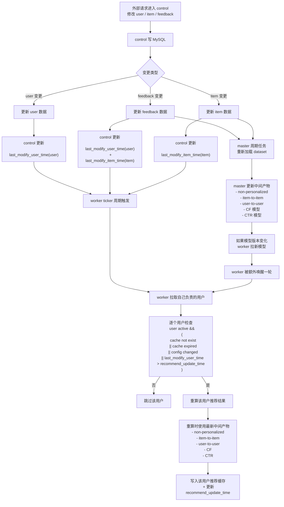

# Offline 刷新流程

## 1. 目标

本文档说明一个关键问题：

- 当 `user / item / feedback` 发生变更后
- `control`、`master`、`worker` 分别做什么
- `worker` 最终是如何决定某个用户是否需要重算推荐缓存的

这里的结论主要参考 `gorse` 的做法，并用于帮助 `Nexus` 明确 `offline` 第一阶段的设计思路。

## 2. 总体流程图



## 3. 三类变更分别怎么传导

### 3.1 `user` 变更

`user` 变更后，系统会直接更新这个用户的最后修改时间。

核心效果是：

- `last_modify_user_time(user)` 被更新
- `worker` 在下一轮周期扫描时，会发现：
  - `last_modify_user_time > recommend_update_time`
- 因此这个用户会被判定为需要重算

也就是说：

`user` 变更是最直接的用户级刷新触发因素。

### 3.2 `feedback` 变更

`feedback` 变更有两层影响。

第一层是直接影响：

- 更新相关用户的 `last_modify_user_time`
- 因此相关用户在下一轮会被判定为需要重算

第二层是间接影响：

- `feedback` 会进入 `master` 周期加载的数据集
- 进一步影响中间产物，例如：
  - `non-personalized`
  - `item-to-item`
  - `user-to-user`
  - `CF` 模型
  - `CTR` 模型

所以：

- `feedback` 既会直接触发相关用户刷新
- 也会间接改变后续所有用户重算时所依赖的推荐基础产物

### 3.3 `item` 变更

`item` 变更和 `user`、`feedback` 不同。

它不会直接告诉系统：

- 哪些用户应该立刻重算

在 `gorse` 这种做法里，`item` 变更主要是：

- 更新 `last_modify_item_time(item)`
- 等待 `master` 在周期任务里重新加载数据集
- 然后重新更新中间产物

这些中间产物包括：

- `non-personalized`
- `item-to-item`
- `user-to-user`
- `CF` 模型
- `CTR` 模型

因此：

- `item` 变更不会直接让某个用户缓存立刻失效
- 它主要先影响推荐计算依赖的中间产物
- 之后等某个用户在未来真正被重算时，才会使用这些更新后的中间产物

## 4. `worker` 是如何决定某个用户要不要重算的

`worker` 被唤醒后，不会直接因为 `item` 变更就知道哪些用户该重算。

它的方式更简单：

1. 拉取当前节点负责的用户集合
2. 对每个用户执行一次刷新判定

判定规则可以概括为：

```text
user active
&& (
  cache not exist
  || cache expired
  || config changed
  || last_modify_user_time > recommend_update_time
)
```

满足条件的用户，会进入本轮推荐重算。

不满足条件的用户，会被直接跳过。

## 5. 中间产物到底怎么被使用

这里最容易混淆，需要明确：

- 中间产物不是用来判断“哪些用户需要刷新”的
- 中间产物是用来在“用户已经确定需要刷新之后”，帮助生成新的推荐结果

也就是说：

### 刷新判定阶段

决定：

- 这个用户要不要重算

主要依赖：

- cache 是否存在
- cache 是否过期
- 配置是否变化
- `last_modify_user_time`

### 推荐计算阶段

决定：

- 这个用户的新推荐结果怎么生成

主要依赖：

- `non-personalized`
- `item-to-item`
- `user-to-user`
- `CF`
- `CTR`

## 6. 模型更新如何唤醒 `worker`

`worker` 有两种唤醒方式：

### 6.1 ticker 周期唤醒

`worker` 会用 `ticker` 周期性醒来，执行一轮用户扫描。

### 6.2 模型更新后的额外唤醒

`worker` 会通过 gRPC 从 `master` 拉取 meta。

如果发现：

- `CF` 模型版本更新
- 或 `CTR` 模型版本更新

那么：

- `worker` 会拉取新模型
- 然后通过本地 channel 再触发一轮执行

这里需要注意：

- 这不是 `master` 主动 push 一个“某用户要更新”的任务
- 只是 `worker` 发现模型变了，于是主动再跑一轮

## 7. 最终结论

用最直白的话总结整个链路：

- `user` 变更：
  - 直接更新用户修改时间
  - 下轮 `worker` 会重算这个用户

- `feedback` 变更：
  - 直接更新相关用户修改时间
  - 下轮 `worker` 会重算相关用户
  - 同时也会影响 `master` 生成的新中间产物

- `item` 变更：
  - 不直接决定哪些用户要重算
  - 先影响 `master` 更新中间产物
  - 等后续某个用户真正重算时，再用到这些新的中间产物

再压缩成一句：

`gorse` 的核心不是“item 变了就立刻找到受影响用户”，而是“user / feedback 直接驱动用户缓存重算，item 先驱动中间产物更新，用户结果靠后续重算逐步收敛”。
