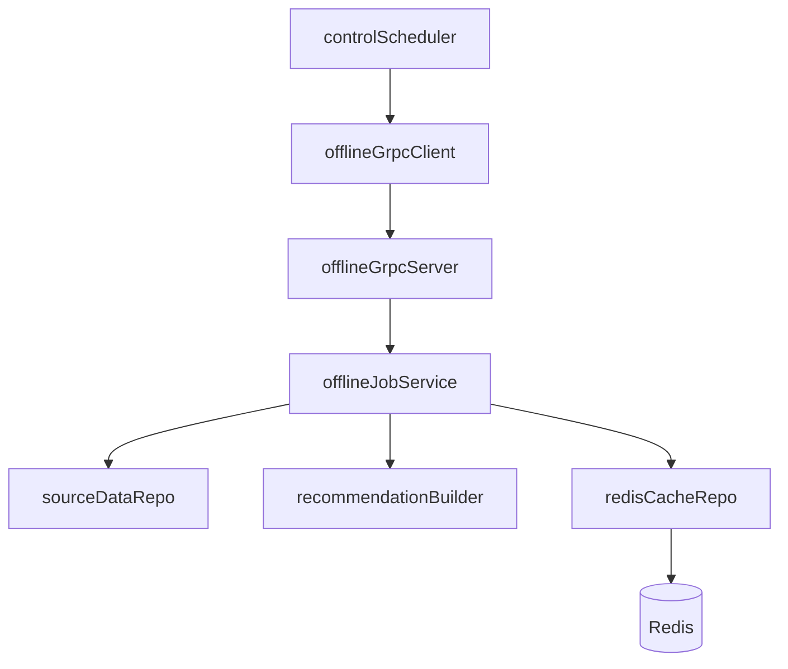

# Offline 节点设计

## 1. 定位

`offline` 节点负责离线任务执行，本质上更接近 `worker`
边界约定：

- `control`：负责任务定义、调度、下发、状态管理
- `offline`：负责执行离线任务并写出离线产物
- `online`：负责读取离线产物并参与在线推荐

## 2. 当前架构选择

本项目当前明确采用以下方案：

- 调度放在 `control`
- `control` 通过 `gRPC` 主动调用 `offline`
- `offline` 执行离线推荐任务
- 第一阶段离线产物写入 `Redis`

这条线更接近 `gorse` 的职责划分：

- `master/control`：配置、任务、调度、模型与集群管理
- `worker/offline`：离线生成推荐结果并写缓存

## 3. `offline` 不负责什么

第一阶段先明确不做以下事情：

- 不负责全局任务调度
- 不负责管理任务生命周期
- 不负责管理节点编排
- 不负责管理模型版本
- 不先做完整训练平台
- 不先做复杂特征平台

这些能力如果后面需要，也优先由 `control` 驱动，再由 `offline` 执行。

## 4. 第一阶段目标

第一阶段只做一条最小闭环：

1. `control` 定义一个离线任务
2. `control` 通过 `gRPC` 调用 `offline`
3. `offline` 执行任务
4. `offline` 将结果写入 `Redis`
5. `control` 记录任务结果

先证明这四件事是通的：

- 能调度
- 能执行
- 能写缓存
- 能回报结果

## 5. 第一类任务

建议第一阶段仅实现一个任务：

- `refresh_user_recommendations`

含义：

- 为一批用户生成离线推荐结果
- 按用户维度写入推荐缓存

先不追求复杂算法，先保证链路闭环。

## 6. 第一阶段推荐策略

第一阶段推荐策略建议故意做简单：

- 最新内容
- 热门内容
- 或简单规则召回

原因：

- 先验证工程链路
- 不把算法复杂度和架构复杂度混在一起
- 后续可以在不改调度链路的前提下替换召回策略

## 7. 产物写入

第一阶段离线产物先写 `Redis`。

推荐按用户维度存储，例如：

```text
recommend:user:{user_id}
```

值建议至少包含：

- `version`
- `generated_at`
- `items`

示例：

```json
{
  "version": "dev",
  "generated_at": "2026-03-10T10:00:00Z",
  "items": [
    "item-1",
    "item-2",
    "item-3"
  ]
}
```

如果后面要补充：

- `strategy`
- `digest`
- `expire_at`

也可以在这个结构上继续扩展。

## 8. 任务下发方式

当前选择：

- `control` 主动下发
- 协议使用 `gRPC`

原因：

- 更符合“control 统一调度”的边界
- 比 `offline` 轮询拉任务更直接
- 第一阶段更容易把任务状态与调度逻辑统一放在 `control`

## 9. 推荐的数据流



## 10. 模块分层建议

### `control`

负责：

- 定义离线任务
- 触发任务
- 通过 gRPC 下发任务
- 记录任务状态

### `offline`

负责：

- 暴露 gRPC worker 接口
- 接收任务请求
- 执行离线推荐逻辑
- 将结果写入 Redis
- 返回执行结果

### `online`

后续负责：

- 读取离线推荐缓存
- 参与在线过滤、重排、fallback

## 11. `offline` 目录建议

建议 `offline` 模块按和 `control` 类似的方式收敛：

- `offline/config`
  - 配置结构与 `Load()`
- `offline/internal`
  - 运行时壳子
- `offline/internal/application`
  - 离线任务编排
- `offline/internal/domain`
  - 任务与产物的领域模型
- `offline/internal/infrastructure`
  - Redis 写入、数据源读取
- `offline/internal/port/grpc`
  - gRPC 服务端实现

## 12. MVP 开发顺序

建议顺序：

1. 定义离线任务请求/响应模型
2. 定义 `control -> offline` 的 gRPC 接口
3. 搭出 `offline` 的运行时骨架
4. 实现 Redis 写入适配器
5. 实现一个最简单的离线推荐任务
6. 在 `control` 中补调度与下发壳子

## 13. 后续演进方向

当第一条链路跑通后，再逐步增强：

- 多任务类型
- 多离线推荐策略
- 分片执行
- 失败重试
- 幂等控制
- 模型产物接入
- 特征/样本处理
- 更复杂的训练链路

第一阶段的原则是：

- 先让 `offline` 成为一个真正可执行的 worker
- 不把调度、训练、特征平台一次性全塞进去
